# Excellent-Nd 設計

本書は Excellent-Nd の設計判断の正本である。Symphony に関する事実は 2026-09-18 時点の OpenAI 公式リポジトリ `be10a1b79df723d6d7612b5651c8522704dafb2e` を確認した。未確定事項は [open-questions.md](open-questions.md) に分離する。

## 背景と課題

ChatGPT 上の相談は、要求を絞り、選択肢を比較し、実装前に人間が判断する場として扱いやすい。一方、その思考過程をすべて Issue にすると、小規模開発では記録の作成と同期が実作業より重くなりうる。また、会話全文や実行ログ全文を ChatGPT と Codex の間で往復させると、不要な文脈、トークン消費、再解釈の誤差が増える。

必要なのは新しいプロジェクト管理基盤ではなく、承認済みの作業単位と結果だけを会話と実行環境の間で受け渡す細い境界である。

## 目的

Excellent-Nd は、ChatGPT で作った Plan から人間が GO を出した 1 Task を Codex に渡し、実装・調査・検証の結果を構造化して ChatGPT に戻す Conversation-first / Plan-and-Execute ワークフローを実現する。

## 設計原則

1. ChatGPT を要求整理、Plan、GO、結果確認、次の判断の主 UI とする。
2. 人間の GO 前に実行しない。
3. 全会話ではなく、実行に必要な最小の Execution Packet を渡す。
4. 生ログではなく、機械情報と短い要約からなる Execution Result を戻す。
5. GitHub Issue は必要な Task にだけ使う。
6. Symphony と Codex が持つ orchestration / execution 能力を再実装しない。
7. Git と checkpoint を引継ぎ可能な状態とし、Codex 会話全文を永続状態にしない。
8. 管理画面や状態を増やすより、人間が管理する情報量を減らす。

## Conversation-first と Issue-first

| 観点 | Conversation-first（Excellent-Nd） | Issue-first（Symphony） |
| --- | --- | --- |
| 開始点 | ChatGPT 上の相談と Plan | tracker の実行可能な Issue |
| Task 化 | GO 後、必要な 1 Task のみ | Issue が実行単位 |
| 永続化 | 必要に応じ Git / checkpoint / Issue | tracker と Issue workspace |
| 適する作業 | 短時間の調査・単独作業を含む | 共有・長期・自律継続する作業 |

両者は競合しない。Durable Task は Issue 化して Symphony に渡し、lightweight Task は Issue を必須にしない。後者の実行方法は V1 着手前に検証する。

## 責務分離

### Symphony 公式仕様で確認できる責務

[Symphony README](https://github.com/openai/symphony/blob/be10a1b79df723d6d7612b5651c8522704dafb2e/README.md)、[SPEC.md](https://github.com/openai/symphony/blob/be10a1b79df723d6d7612b5651c8522704dafb2e/SPEC.md)、[Elixir implementation README](https://github.com/openai/symphony/blob/be10a1b79df723d6d7612b5651c8522704dafb2e/elixir/README.md) から、次を確認した。

- Symphony は tracker を継続的に読み、Issue ごとの隔離 workspace で coding agent session を実行する scheduler / runner である。
- `WORKFLOW.md` を設定と prompt の契約として使い、polling、bounded concurrency、retry、reconciliation、workspace lifecycle、observability を扱う。
- Codex App Server を起動し、thread / turn を作成または継続する。同じ worker run 内の continuation turn は同じ thread を再利用する。
- runtime event は session、turn、エラー、必要入力、任意の usage 情報などを上流へ通知できる。
- tracker への書込みは、通常、Symphony 自身の業務ロジックではなく coding agent と provider-native tool が担う。
- 仕様は Draft v1 である。公式 Elixir 実装は評価用 prototype であり、production-ready とは扱えない。

### Excellent-Nd の設計判断

Excellent-Nd は次だけを担当する。

- ChatGPT 上の Plan と Human GO から、実行対象となる 1 Task を切り出す。
- Task を Execution Packet に圧縮する。
- lightweight Task と Durable Task のどちらとして扱うか、人間が判断できる基準を示す。
- Symphony または直接の Codex 実行へ Task を受け渡す最小経路を定める。
- 実行結果を Execution Result と checkpoint に整理し、ChatGPT から確認可能にする。
- Human Gate で止まった事項を人間へ戻し、同じ Task を継続可能にする。

Excellent-Nd は Symphony の scheduler、runner、tracker polling、workspace manager、retry、concurrency、Codex App Server client、thread / turn 管理、telemetry 収集を複製しない。

### 各サービスの役割

| 要素 | 役割 |
| --- | --- |
| Human | GO、仕様判断、リスク受容、Human Gate の回答 |
| ChatGPT | 要求整理、Plan、Task 切出し支援、結果提示、次の判断支援 |
| Excellent-Nd | Execution Packet / Result の境界と、最小限の受渡し workflow |
| GitHub | 必要な Issue・PR・永続的な共有履歴。常時必須ではない |
| Symphony | Durable Task の Issue-first orchestration と実行観測 |
| Codex | 対象開発環境での実装、調査、検証 |
| Git | source、branch、commit、diff の正本 |

GitHub 操作には、利用可能なら ChatGPT の公式 GitHub 連携を優先する。Excellent-Nd 独自の GitHub API client は、公式連携と Symphony の tracker integration で不足が確認されるまで作らない。

## 基本フロー

```mermaid
sequenceDiagram
    actor H as Human
    participant C as ChatGPT
    participant E as Excellent-Nd workflow
    participant S as Symphony / Codex
    participant G as GitHub (必要時)

    H->>C: 要求・課題を相談
    C->>H: Plan
    H->>C: GO
    C->>E: 1 Task + Execution Packet
    alt Durable Task
        E->>G: Issue を作成・参照
        S->>G: Issue を polling
        G-->>S: 実行対象 Issue
    else lightweight Task
        E->>S: 最小実行経路（要検証）
    end
    S-->>E: 実行結果 / runtime facts
    E->>E: Execution Result / checkpoint に整理
    E-->>C: 構造化結果
    C-->>H: 結果、blocked、次の判断
```



## Task の種類

### lightweight Task

- ChatGPT 上の Plan から生成する。
- GitHub Issue を必須にしない。
- 短時間、単独、引継ぎ不要で、永続的な監査記録を要しない作業に使う。
- V1 で自動判定しない。

### Durable Task

- GitHub Issue として作成するか、既存の GitHub Issue に関連付ける。
- 複数人での共有、別担当への引継ぎ、長期作業、Human Gate、PR との明示的な関連、履歴・判断根拠の保存が必要な場合に使う。
- Symphony の Issue-first execution が適する場合に選ぶ。

昇格は一方向に固定しないが、Task の途中で上記条件が生じた場合は、checkpoint と参照を添えて Issue 化できる設計を目指す。自動 routing は V1 非対象である。

## Execution Packet

Codex には会話全文ではなく、最低限次を渡す。

| 項目 | 内容 |
| --- | --- |
| `objective` | この Task で達成する 1 つの目的 |
| `constraints` | 禁止事項、範囲、互換性、安全条件 |
| `acceptance_criteria` | 完了を判定できる条件 |
| `relevant_decisions` | 実行に影響する確定済み判断のみ |
| `relevant_references` | 対象 Issue、文書、ファイル、commit 等 |

Packet の schema、保存形式、transport は未確定である。V1 では上記意味を満たす最小形式を検証する。

## Execution Result

ChatGPT へは全文ログではなく、次を基本に返す。

| 項目 | 内容 |
| --- | --- |
| `status` | 完了、blocked、失敗などの結果 |
| `summary` | 人間が判断するための短い要約 |
| `changed_files` | 変更ファイル一覧 |
| `diff_summary` | 機械的 diff 統計と主要変更 |
| `verification` | 実行した test / check、exit status、結果 |
| `risks` | 既知の影響や不確実性 |
| `blockers` | 人間判断または外部条件待ち |
| `remaining_work` | 未完了の範囲 |

ファイル一覧、diff 統計、test 結果、exit status、token / rate-limit telemetry など取得可能な事実は、LLM に再生成させず元データから構造化する。LLM は要約と判断支援に使う。

## Codex thread と checkpoint

- 同じ Task の追加修正、test failure 修正、review 対応は、利用可能なら同一 thread を継続する。
- 別 Task は新規 thread を基本とする。
- 別マシンへの引継ぎは thread の移送に依存しない。
- Git は source、branch、commit、diff を保持する。
- checkpoint は objective、decisions、completed work、remaining work、verification、risks / blockers を保持する。

会話履歴は補助的な実行文脈であり、復旧に必要な永続状態ではない。Symphony 公式仕様が保証する同一 thread の継続範囲と、Excellent-Nd が望む Task 単位の継続範囲が一致するかは検証する。

## Human Gate

V1 では approval engine を作らない。要求の曖昧さ、public API、DB migration、security-sensitive な変更、production 影響、大きな dependency 更新、重大な破壊的変更などで人間判断が必要なら、次の流れにする。

```text
Codex → blocked / question → ChatGPT → Human decision → continuation
```

Durable Task では Issue comment / label 等を判断の永続記録に使える。Symphony の approval / user-input policy は実装定義であり、Elixir prototype の blocked 状態は memory 上の状態であるため、再開方法と永続化は事前検証する。

## トークン削減

- Plan 全体から 1 Task に必要な決定だけを Packet へ入れる。
- 同じ情報を会話、Issue、prompt に重複させない。
- continuation では変更点と残作業を中心にし、元 prompt を無条件に再送しない。
- Git、test、diff、exit status、usage は可能な限り機械データのまま扱う。
- ChatGPT には判断に必要な要約を示し、詳細ログは参照可能な場所に残す。

## V1 で再実装しない領域

- Symphony 自体、Codex Runner、agent harness
- scheduler、retry、concurrency、workspace manager、thread / turn 管理
- multi-agent orchestration、複数 AI provider
- SaaS、multi-tenant、大規模チーム scheduler
- 複数 tracker の統合、独自 Kanban、大型 Web UI、中央 DB
- 独自 notification daemon / webhook relay
- 汎用 workflow engine

将来候補は、実運用で不足を確認してから検討する。V1 の予定としては扱わない。
