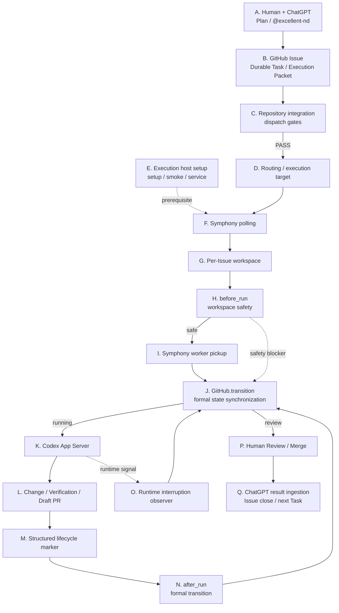
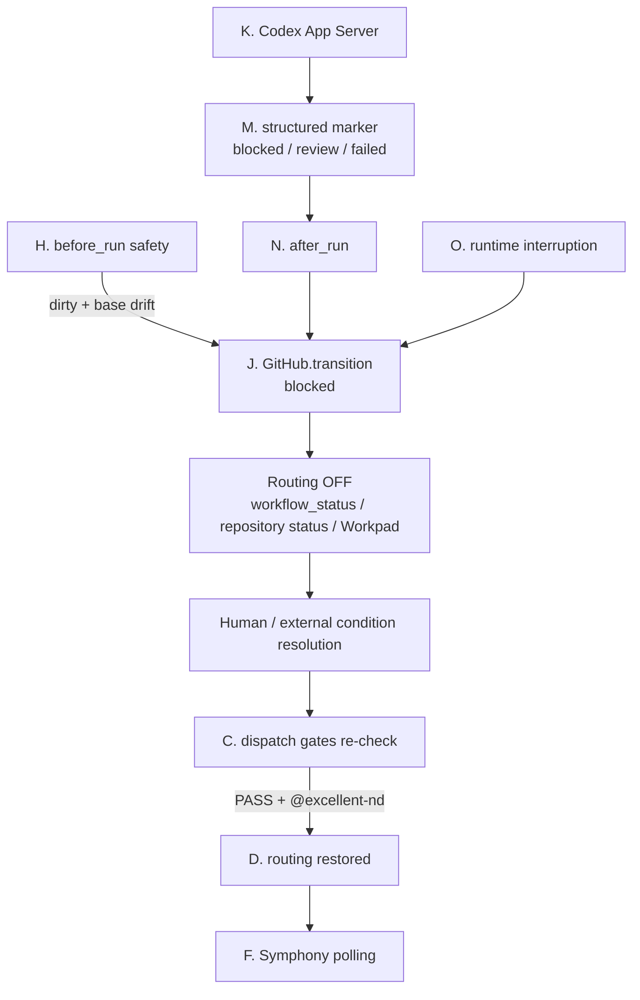
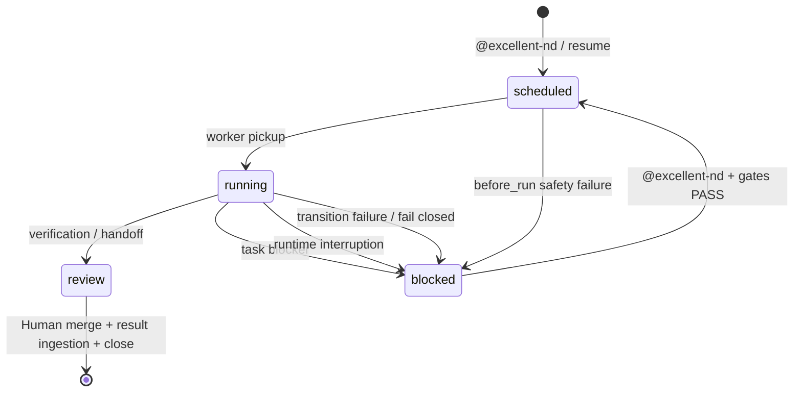

# Excellent-Nd Runtime Architecture Guide

[日本語 (authoritative)](runtime-architecture.md) | [简体中文](runtime-architecture.zh-CN.md)

This guide explains Excellent-Nd for readers who are new to GitHub Issues, OpenAI Symphony, and Codex App Server. Its goal is to make it possible to trace what happens, in what order, and which source code is responsible.

The Japanese version is authoritative. For installation and day-to-day operations, see the [User Guide](operations.en.md). For design goals, see [Design](design.md).

> "Symphony" here means the `openai/symphony` runtime pinned by `config/runtime-lock.json`. Treat that file as the source of truth for the validated version. For upstream behavior, see the [OpenAI Symphony SPEC](https://github.com/openai/symphony/blob/main/SPEC.md) and [Elixir implementation README](https://github.com/openai/symphony/blob/main/elixir/README.md).

---

## 1. Core terms

| Term | Beginner meaning | Role in Excellent-Nd |
| --- | --- | --- |
| ChatGPT | Main human planning and decision UI | Task split, explicit `@excellent-nd` instruction, result ingestion |
| GitHub Issue | One durable work ticket | Durable Task, Execution Packet, Workpad |
| Execution Packet | Instructions given to Codex | Entire Issue body |
| routing label | Switch that makes a Task dispatchable | Usually `symphony-ready` |
| target label | Selects which execution host may pick it up | `nd-target:<execution_target>` |
| workflow status | Logical Task state | `scheduled / running / blocked / review` |
| repository-native status | Repository's own progress surface | labels or a GitHub Project field |
| Symphony | Coding-agent orchestrator | polling, workspace, hooks, retry, Codex launch |
| workspace | Per-Issue working directory | normally one workspace per Issue |
| observer | Excellent-Nd process around Symphony | state synchronization and interruption handling |
| Codex App Server | Coding worker process | repository investigation, changes, verification |
| Workpad | Durable execution evidence on the Issue | start, blocker, verification, handoff |
| transition | Formal lifecycle update | body, routing, repository status, Workpad |
| fail closed | Stop when correctness cannot be proven | disable routing and preserve evidence |

Excellent-Nd is conversation-first for humans and Issue-first internally. The Issue is a durable execution record, not the primary human UI.

---

## 2. End-to-end flow

### 2.1 Normal flow mapped to Nodes A-Q

Each block displays its **A-Q** Node identifier. GitHub's Mermaid renderer does not expose diagram click links consistently across views, so the diagram uses A-Q identifiers only. The Node index immediately below is the canonical navigation path.



**Node index:** [A](#node-a) → [B](#node-b) → [C](#node-c) → [D](#node-d) → [E](#node-e) → [F](#node-f) → [G](#node-g) → [H](#node-h) → [I](#node-i) → [J](#node-j) → [K](#node-k) → [L](#node-l) → [M](#node-m) → [N](#node-n) → [O](#node-o) → [P](#node-p) → [Q](#node-q)

Node E is an execution-host prerequisite rather than a per-Task serial step. Node J is the state-synchronization hub: worker start, pre-run blocker, after-run marker, and runtime interruption all converge on the same formal transition path.

### 2.2 Blocked / resume flow



---

---

## 3. Symphony vs Excellent-Nd

Upstream Symphony polls an issue tracker, manages per-Issue workspaces, runs lifecycle hooks, launches a coding agent, and manages retries, continuation, and concurrency.

Excellent-Nd adds policy and GitHub lifecycle synchronization around that runtime.

| Area | Primary owner | Excellent-Nd source |
| --- | --- | --- |
| Issue polling | Symphony | generated `WORKFLOW.md` |
| required-label filtering | Symphony | `config/WORKFLOW.md.tpl` |
| workspace lifecycle | Symphony | workspace config + hooks |
| retry / continuation | Symphony | upstream runtime |
| Codex launch | Symphony | `codex.command` |
| `@excellent-nd` / Plan | Excellent-Nd Skill | `skills/excellent-nd/` |
| repository gates | Excellent-Nd | `scripts/repository_adapter.py` |
| target routing | Excellent-Nd | `scripts/execution_target.py` |
| workspace safety | Excellent-Nd | `runtime_observer.py::prepare_workspace` |
| running-state detection | Excellent-Nd | `runtime_observer.py::run_observer` |
| Project status mapping | Excellent-Nd | `repository_adapter.py::transition_event` |
| blocked/review/failed handoff | Excellent-Nd | structured marker + observer |
| service management | Excellent-Nd | systemd helpers |
| version pin / setup / smoke | Excellent-Nd | `runtime-lock.json`, `setup.py`, `smoke.py` |

Symphony hooks used by Excellent-Nd:

- `after_create`: initialize a newly created workspace
- `before_run`: safety check before Codex starts; failure aborts the attempt
- `after_run`: lifecycle handoff after an attempt

---

## 4. Node-by-node implementation map

### Node A

**ChatGPT / explicit execution instruction**

Sources:

- `skills/excellent-nd/SKILL.md`
- `skills/excellent-nd/references/task-schema.md`
- `skills/excellent-nd/references/workflow.md`

ChatGPT and the human define objective, constraints, acceptance criteria, dependencies, owner, and execution target. Execution is authorized by explicitly naming `@excellent-nd` in the current user message; no separate approval phrase is required.

### Node B

**GitHub Issue as the Durable Task**

The Issue stores the Execution Packet and durable evidence. The complete Issue body is passed to Codex as task context. Native Issue state, `workflow_status`, routing, and repository-native status are distinct surfaces.

### Node C

**Repository integration / dispatch gates**

Sources:

- `scripts/repository_config.py`
- `scripts/repository_adapter.py::resolve_context`
- `scripts/repository_adapter.py::evaluate_gates`
- `scripts/repository_adapter.py::preflight`

Excellent-Nd does not hard-code repository-specific fields such as Status, Agent, or Human Approval. A consumer repository configures only the gates it uses in `.excellent-nd/repository.json`. Unavailable or ambiguous required data fails closed.

### Node D

**Routing / execution target**

Sources:

- `scripts/execution_target.py`
- `.excellent-nd/targets/*.json`
- `config/WORKFLOW.md.tpl`

A routing label controls dispatchability; a target label identifies the execution host. `enabled: true` in target inventory means configured/assignable, not an online heartbeat.

### Node E

**Execution host setup**

Sources:

- `scripts/setup.py`
- `scripts/smoke.py`
- `scripts/service_runner.py`
- `scripts/systemd_service.py`
- `config/runtime-lock.json`

Setup validates prerequisites, downloads the pinned Symphony asset, verifies its checksum, generates `WORKFLOW.md`, runs smoke checks, writes host/target identity, and may install/restart the systemd user service.

### Node F

**Symphony polling**

Sources:

- `config/WORKFLOW.md.tpl`
- generated `.excellent-nd/WORKFLOW.md`
- upstream Symphony

Symphony polls the tracker and filters candidates using configured active states and required labels. The polling implementation itself is upstream Symphony code.

### Node G

**Per-Issue workspace**

Symphony owns the per-Issue workspace lifecycle. Excellent-Nd expects Issue-correlated workspace naming and uses workspace identity during host-side safety checks.

Primary source entry points:

- `config/WORKFLOW.md.tpl`
- `runtime_observer.py::issue_from_workspace`

### Node H

**before_run workspace safety**

Sources:

- `runtime_observer.py::prepare_workspace`
- `runtime_observer.py::workspace_decision`

| Workspace | Base relation | Result |
| --- | --- | --- |
| clean | drifted | refresh to remote default branch |
| dirty | same base | preserve and continue |
| dirty | drifted | block before Codex starts |

Dirty + drift is not auto-reset because uncommitted work might be valuable evidence.

### Node I

**Symphony worker pickup**

Sources:

- `runtime_observer.py::worker_started_issue`
- `runtime_observer.py::run_observer`

Only the validated exact Symphony worker-start event is accepted as proof that work actually began.

### Node J

**Formal GitHub lifecycle transition**

Sources:

- `runtime_observer.py::GitHub.transition`
- `runtime_observer.py::runtime_event_for`
- `repository_adapter.py::transition_event`

Order:

1. remove routing
2. update Issue body workflow status
3. update repository-native status when configured
4. write Workpad evidence
5. restore routing only when the final state requires it and all prior updates succeeded

If an intermediate update fails, routing remains disabled. Worker pickup becomes `running` and maps to repository event `execution_started`.

### Node K

**Codex App Server execution**

The workflow launches `codex app-server` under `workspace-write`. Codex performs repository investigation, changes, and verification without bypassing protected Git metadata.

### Node L

**Changes / verification / Draft PR**

The expected output is reviewable evidence: changed files, verification, branch/commit, Draft PR, residual risk, and Workpad handoff. Code production alone is not treated as final completion.

### Node M

**Structured lifecycle marker**

Marker file:

`.excellent-nd/runtime-transition.json`

Schema:

`excellent-nd/runtime-transition@v1`

Sources:

- `validate_transition_marker`
- `transition_identity`
- `validated_receipt`

Allowed transitions are `blocked`, `review`, and `failed`.

### Node N

**after_run formal transition**

Sources:

- `WORKFLOW.md.tpl` `after_run`
- `runtime_observer.py::apply_transition_marker`

The host applies the structured marker through the same formal `GitHub.transition` path. Idempotency receipts bind repository, Issue, run, attempt, and transition. Missing, corrupt, unknown, or invalid markers fail closed to blocked.

### Node O

**Runtime interruption observation**

Sources:

- `classify_interruption`
- `extract_context`
- `interruption_workpad`
- `run_observer`

Examples include quota exhaustion, long rate limits, turn timeout, App Server startup failure, and abnormal agent exit.

### Node P

**Human review / merge**

Review disables routing. Human review/merge remains a gate; the runtime does not interpret “Codex finished writing” as final acceptance.

### Node Q

**ChatGPT result ingestion**

ChatGPT reads the Issue, PR, Workpad, and verification, then reintegrates the result into the original Plan. After accepted completion, the Issue can be closed and the next Task can proceed.

---

## 5. The five state surfaces

| Surface | Example | Meaning |
| --- | --- | --- |
| GitHub Issue native state | open / closed | Active vs terminal ticket |
| `workflow_status` | scheduled / running / blocked / review | Excellent-Nd logical state |
| routing label | `symphony-ready` | Whether Symphony may pick it up |
| target label | `nd-target:worker-a` | Which host may pick it up |
| repository-native status | Todo / Working / Hold | Consumer repository's status authority |

Normal transitions keep these surfaces consistent. Status authority is configured in `.excellent-nd/repository.json` as either labels or a GitHub Project field.

---

## 6. State model



---

## 7. Unexpected defects and improvements discovered so far

This section records Excellent-Nd Core findings. Consumer-repository policy conflicts are a different class of problem.

| Finding | Impact | Fix / lesson | Related |
| --- | --- | --- | --- |
| Routing and visible status were easy to conflate | UI changes could alter dispatch semantics | Separate routing from status | PR #7 |
| execution_target metadata alone did not route to a specific host | Multiple hosts could not be safely distinguished | Add target-specific routing labels and inventory | PR #11 |
| setup missed the `write_target_record` import | Setup could pass smoke and fail afterwards | Add import + regression test | PR #13 |
| Repository / Issue integration was not a first-class installation layer | Existing labels/automation could conflict | Add explicit integration review and config SSOT | PR #15 |
| Repository-specific Project fields could not be assumed globally | Core became repository-specific | Generic event mapping and dispatch gates | PR #17 |
| CI could report success with zero discovered tests; invalid repository path input was accepted | False confidence and weak input validation | Real test discovery + fail-closed validation | PR #18 |
| Foreground runtime was weak for long-running hosts | Harder restart/status/log operations | systemd user service lifecycle | PR #21 |
| Worker pickup was not connected to `execution_started` | Codex could run while UI still looked not-started | Parse only the validated worker-start event | Issue #22 / PR #23 |
| Task-level blocker could stop with comment-only evidence | body/routing/Project status could diverge | Structured marker -> formal transition | Issue #22 / PR #23 |
| Dirty workspace could remain on an old base and still start Codex | stale-base execution | dirty + base drift blocks before Codex | Issue #22 / PR #23 |

### Core vs consumer repository

A Core bug reproduces independently of one repository's business rules—for example worker-start state propagation or hook handling.

A consumer repository problem depends on that repository's policy or mapping—for example an incorrect `.excellent-nd/repository.json` gate or contradictory local governance.

Do not solve a consumer-specific rule by hard-coding it into Excellent-Nd Core.

A useful question is:

> Would the same input reproduce in another repository with equivalent configuration?

---

## 8. Debugging order

When the UI does not clearly show whether work is running:

1. GitHub Issue native state
2. `workflow_status`
3. routing / target labels
4. repository-native status
5. latest Workpad
6. branch / PR
7. systemd service
8. observer / Symphony process
9. runtime journal
10. workspace HEAD and dirty state

Host checks:

```sh
systemctl --user status 'excellent-nd@<instance>.service' --no-pager
systemctl --user is-active 'excellent-nd@<instance>.service'
journalctl --user -u 'excellent-nd@<instance>.service' -n 100 --no-pager
pgrep -af 'runtime_observer.py|symphony'
```

Workspace checks:

```sh
git status --short
git rev-parse HEAD
git diff --check
```

Always compare against a freshly fetched remote default-branch head.

---

## 9. Source code map

| Question | Start here |
| --- | --- |
| Project overview | `README.md`, `docs/design.md` |
| Operator procedures | `docs/operations.en.md` |
| explicit `@excellent-nd` / Skill | `skills/excellent-nd/SKILL.md` |
| Task metadata | `skills/excellent-nd/references/task-schema.md` |
| Repository config | `scripts/repository_config.py` |
| Dispatch gates | `repository_adapter.py::preflight` |
| Project status update | `repository_adapter.py::transition_event` |
| Runtime version pin | `config/runtime-lock.json` |
| Workflow template | `config/WORKFLOW.md.tpl` |
| Execution targets | `scripts/execution_target.py` |
| Setup | `scripts/setup.py` |
| Smoke | `scripts/smoke.py` |
| Service start | `scripts/service_runner.py` |
| Worker start observer | `runtime_observer.py::run_observer` |
| Formal transition | `runtime_observer.py::GitHub.transition` |
| Workspace preflight | `runtime_observer.py::prepare_workspace` |
| Structured marker | `runtime_observer.py::apply_transition_marker` |
| Runtime interruption | `runtime_observer.py::classify_interruption` |
| Regression tests | `tests/test_runtime_observer.py` |

---

## 10. Recommended reading order

1. this guide
2. `README.md`
3. `docs/operations.en.md`
4. `config/WORKFLOW.md.tpl`
5. `scripts/runtime_observer.py`
6. `scripts/repository_adapter.py`
7. `tests/test_runtime_observer.py`
8. upstream Symphony SPEC when deeper details are needed

Update this guide whenever lifecycle nodes, hook contracts, state authority, routing semantics, workspace recovery, or pinned Symphony/Codex behavior changes.