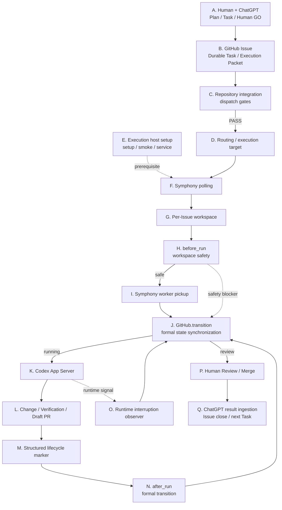
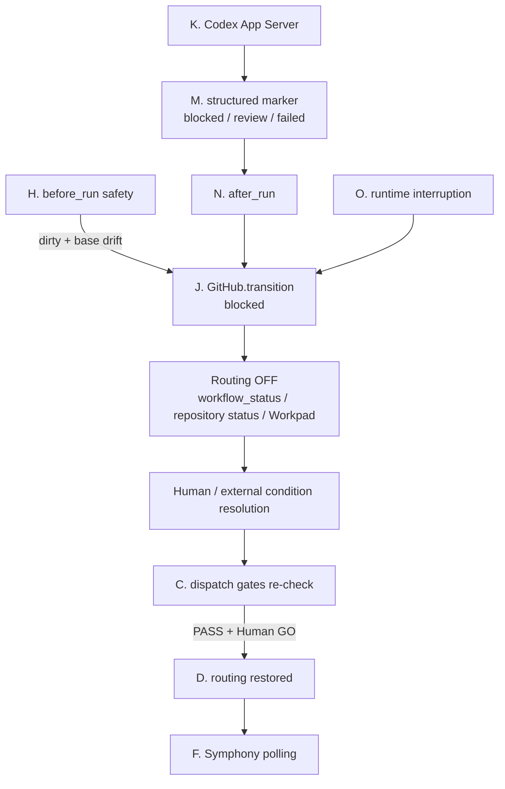
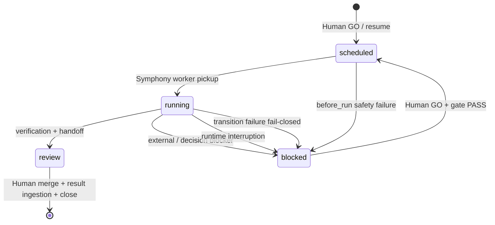

# Excellent-Nd 内部処理ガイド

[English](runtime-architecture.en.md) | [简体中文](runtime-architecture.zh-CN.md)

この文書は、GitHub Issue、OpenAI Symphony、Codex App Serverを初めて扱う人が、Excellent-Ndで「何が、どの順番で、どのコードによって起きるか」を追えるようにするための入門兼内部設計ガイドです。

日本語版を説明の正本とし、英語版・中国語版は意味を同期した翻訳です。インストールや日常運用の手順は[利用ガイド](operations.md)、設計上の全体方針は[設計](design.md)を参照してください。

> この文書でいう「Symphony」は、Excellent-Ndが `config/runtime-lock.json` で固定する `openai/symphony` のruntimeを指します。現在の固定versionは同fileを正本としてください。upstreamの一般仕様は [OpenAI Symphony SPEC](https://github.com/openai/symphony/blob/main/SPEC.md) と [Elixir implementation README](https://github.com/openai/symphony/blob/main/elixir/README.md) を参照してください。Excellent-Nd固有の挙動とupstream Symphonyの責務を混同しないことが重要です。

---

## 1. まず覚える用語

| 用語 | 初心者向けの意味 | Excellent-Ndでの役割 |
| --- | --- | --- |
| ChatGPT | 人間が計画・判断する主画面 | Task分割、Human GO、結果取り込み |
| GitHub Issue | 1件の作業チケット | Durable Task、Execution Packet、Workpadの保管場所 |
| Execution Packet | Codexに渡す作業指示書 | Issue body全体 |
| routing label | 「実行候補にしてよい」というスイッチ | 通常は `symphony-ready` |
| target label | どの実行hostが拾うかを示す印 | `nd-target:<execution_target>` |
| workflow status | Taskの論理状態 | `scheduled / running / blocked / review` |
| repository-native status | 対象repository自身の進捗表示 | labelまたはGitHub ProjectのField |
| Symphony | Issueを監視してworkerを編成するorchestrator | polling、workspace、hook、retry、Codex起動 |
| workspace | Issue専用の作業ディレクトリ | 原則 `GH-<Issue番号>` 単位 |
| observer | Symphonyを外側から監視するExcellent-Nd process | worker start、blocker、state transitionをGitHubへ同期 |
| Codex App Server | 実際にrepository作業を行うagent process | Issue promptを受けて調査・変更・検証する |
| Workpad | Issue上の作業記録 | start、blocker、verification、handoffの証拠 |
| transition | Task状態を変える正式処理 | Issue body、routing、Project Status、Workpadを同期 |
| fail closed | 不明なまま実行を続けない方針 | routingをOFFにして停止する |

### Issueは「人間が毎回操作する主画面」ではない

Excellent-Ndの人間向けUXはChatGPT中心です。Issueは、実行するTaskを長期間追跡できるようにするDurable Taskです。

通常は次のように考えます。

- 人間: ChatGPTで目的、優先順位、Human GOを決める
- GitHub Issue: 実行指示と証拠を保存する
- Symphony: 実行可能Issueを監視してCodexを起動する
- Codex: repository作業を実行する
- ChatGPT: Issue / PR / verificationを読み、元のPlanへ結果を戻す

---

## 2. 全体処理フロー

### 2.1 Node A～Q対応の通常フロー

図の各ブロック先頭に **A～Q** を表示し、本文の同じNodeへ対応させています。GitHub上でMermaid node linkが有効な場合はブロックをクリックすると詳細へ移動できます。利用環境で図内リンクが無効な場合は、図直下のNode indexを使用してください。



**Node index:** [A](#node-a) → [B](#node-b) → [C](#node-c) → [D](#node-d) → [E](#node-e) → [F](#node-f) → [G](#node-g) → [H](#node-h) → [I](#node-i) → [J](#node-j) → [K](#node-k) → [L](#node-l) → [M](#node-m) → [N](#node-n) → [O](#node-o) → [P](#node-p) → [Q](#node-q)

**読み方:** EはTaskごとの直列処理ではなく、F以降を動かすexecution hostの前提です。Jは状態同期のハブで、worker start、before_run blocker、after_run marker、runtime interruptionのすべてが同じ正式transitionへ集約されます。

重要なのは、**Symphonyが直接Project Statusを決めるわけではない**ことです。Symphonyはworker lifecycleを編成し、Excellent-Nd observerがその観測結果をrepository固有の状態へmappingします。

### 2.2 Blocked / Resumeパス

Blocked時も、主フローのNode記号をそのまま使います。



---

---

## 3. SymphonyとExcellent-Ndの境界

OpenAI Symphonyは、一般的なcoding-agent orchestratorです。upstream specificationでは、Issue trackerから候補を取得し、Issueごとのworkspaceを作成し、workspace hookを実行し、coding agentを起動し、retry / continuation / concurrencyを管理します。

Excellent-NdはSymphonyをforkしてその機能を再実装するのではなく、Symphonyの前後にpolicyとGitHub state synchronizationを追加します。

| 領域 | 主担当 | Excellent-Ndでの実装 |
| --- | --- | --- |
| Issue polling | Symphony | generated `WORKFLOW.md` のtracker設定 |
| required labelsで候補絞込 | Symphony | `config/WORKFLOW.md.tpl` |
| per-Issue workspace lifecycle | Symphony | workspace root + hooks |
| retry / continuation | Symphony | upstream runtime |
| Codex App Server起動 | Symphony | `codex.command` |
| Human GO / Plan | Excellent-Nd Skill / ChatGPT | `skills/excellent-nd/` |
| repository固有dispatch gate | Excellent-Nd | `scripts/repository_adapter.py` |
| target routing | Excellent-Nd | `scripts/execution_target.py`、target inventory |
| workspace安全確認 | Excellent-Nd | `runtime_observer.py::prepare_workspace` |
| worker startをrunningへ変換 | Excellent-Nd | `runtime_observer.py::run_observer` |
| Project Status mapping | Excellent-Nd | `repository_adapter.py::transition_event` |
| blocked/review/failed handoff | Excellent-Nd | structured marker + `apply_transition_marker` |
| service常駐 | Excellent-Nd | `service_runner.py` / systemd helper |
| setup / version pin / smoke | Excellent-Nd | `setup.py`, `smoke.py`, `runtime-lock.json` |

### upstream Symphonyについて知っておくこと

Symphonyの仕様上、主なhookは次の意味を持ちます。

- `after_create`: 新しいworkspaceを作った直後
- `before_run`: Codexを起動する前。失敗するとそのattemptを開始しない
- `after_run`: Codex attempt終了後
- `before_remove`: workspace削除前

Excellent-Ndは特に `before_run` と `after_run` を使って、workspace safetyとTask lifecycleをGitHubへ接続しています。

---

## 4. 各ノードの処理詳細とソースコード

<a id="node-a"></a>\n\n### Node A — ChatGPTでPlan / Human GO

**何をするか**

人間とChatGPTがTaskの目的、制約、Acceptance criteria、依存関係、owner、execution targetを決めます。実行する場合はExcellent-Nd SkillのHuman GO規則に従います。

**主なソース**

- `skills/excellent-nd/SKILL.md`
- `skills/excellent-nd/references/task-schema.md`
- `skills/excellent-nd/references/workflow.md`

**出力**

GitHub Issue body。これはCodexに渡るExecution Packetでもあります。

---

<a id="node-b"></a>\n\n### Node B — GitHub IssueをDurable Taskとして保存

**何を保存するか**

- Objective
- Constraints
- Acceptance criteria
- Dependencies
- relevant decisions / references
- Task correlation metadata
- Workpad / verification / blocker

**重要**

Issueのnative state（open/closed）、`workflow_status`、routing label、Project Statusは同じものではありません。

---

<a id="node-c"></a>\n\n### Node C — Repository integration / dispatch gate

**何をするか**

対象repository固有の「開始してよい条件」を評価します。

**主なソース**

- `scripts/repository_config.py`
  - `validate_config`
  - `dispatch_gates`
  - `status_authority`
  - `project_event_value`
- `scripts/repository_adapter.py`
  - `fetch_snapshot`
  - `resolve_context`
  - `evaluate_gates`
  - `preflight`

**考え方**

Excellent-Nd Coreは、`Status`、`Agent`、`Human Approval`のような特定Fieldを全repositoryへ強制しません。必要なgateだけをconsumer repositoryの `.excellent-nd/repository.json` に設定します。

**fail-closed例**

- 必要データを取得できない
- configured Project itemを一意に確認できない
- paginationにより完全性を証明できない
- configured gateがFAIL

この場合は実行しません。

---

<a id="node-d"></a>\n\n### Node D — routing / execution target

**何をするか**

通常Taskは、少なくともrouting labelとtarget labelにより対象hostへ絞り込まれます。

**主なソース**

- `scripts/execution_target.py`
  - `normalize_execution_target`
  - `routing_label`
  - `render_workflow`
- `.excellent-nd/targets/*.json`
- `config/WORKFLOW.md.tpl`

`enabled: true` は「共有台帳上で利用可能」という意味であり、「serviceが今online」というheartbeatではありません。

---

<a id="node-e"></a>\n\n### Node E — setupが実行hostを構成

**何をするか**

`scripts/setup.py` は次を行います。

1. prerequisites確認
2. repository integration読込
3. validated Symphony asset取得
4. SHA-256検証
5. generated `.excellent-nd/WORKFLOW.md` 作成
6. host identity作成
7. smoke test
8. target inventory生成
9. 必要ならsystemd user service install / restart

**主なソース**

- `scripts/setup.py::main`
- `config/runtime-lock.json`
- `scripts/smoke.py::main`
- `scripts/service_runner.py`
- `scripts/systemd_service.py`

---

<a id="node-f"></a>\n\n### Node F — SymphonyがIssueをpoll

**何をするか**

generated `WORKFLOW.md` のtracker設定を読み、GitHub Issuesをpollします。

Excellent-Nd標準templateでは、candidateは概念的に次を満たします。

- Issueがactive state
- routing labelあり
- target labelあり

**主なソース**

- `config/WORKFLOW.md.tpl`
- generated `.excellent-nd/WORKFLOW.md`
- upstream `openai/symphony`

SymphonyのpollingそのものはExcellent-Nd Python codeではありません。

---

<a id="node-g"></a>\n\n### Node G — Issueごとのworkspaceを準備

SymphonyはIssueごとのworkspaceを管理します。Excellent-Ndではworkspace名からIssue番号を復元できるよう、`GH-<number>` を前提にする処理があります。

**主なソース**

- `runtime_observer.py::issue_from_workspace`
- `WORKFLOW.md.tpl` の `workspace.root`
- `after_create` hook

---

<a id="node-h"></a>\n\n### Node H — before_runでworkspace safetyを確認

**何をするか**

Codex開始前に `runtime_observer.py before-run` が呼ばれます。

**主なソース**

- `runtime_observer.py::prepare_workspace`
- `runtime_observer.py::workspace_decision`
- `WORKFLOW.md.tpl` の `before_run`

判定は次です。

| workspace | local HEAD vs remote | 動作 |
| --- | --- | --- |
| clean | 異なる | remote default branchへrefresh |
| dirty | 同じ | 現在の作業を保全して継続 |
| dirty | 異なる | **Codexを開始せずblocked** |

dirty + base driftを自動resetしない理由は、未commit成果を消失させないためです。

---

<a id="node-i"></a>\n\n### Node I — Symphonyがworkerをpickup

Symphonyが実際にworker attemptを開始すると、pinned runtimeが確実なstart eventをlogへ出します。

Excellent-Ndは任意の「それっぽいログ」ではなく、検証済みのexact eventだけをworker startとして扱います。

**主なソース**

- `runtime_observer.py::worker_started_issue`
- `runtime_observer.py::run_observer`

worker startを検出すると:

```text
Symphony worker start
  -> GitHub.transition(..., "running")
  -> execution_started event
  -> repository-native Status
```

となります。

---

<a id="node-j"></a>\n\n### Node J — GitHub.transitionが状態を一元更新

PR #23以降、lifecycle state updateの中心は `GitHub.transition` です。

**主なソース**

- `runtime_observer.py::GitHub.transition`
- `runtime_observer.py::runtime_event_for`
- `repository_adapter.py::transition_event`

**更新順序**

1. routingを先にOFF
2. Issue bodyの `workflow_status` を更新
3. GitHub Project authorityならrepository固有event mappingを更新
4. Workpad commentを保存
5. 全て成功した場合だけ、running / scheduledで必要なroutingを復元

途中で失敗するとrouting OFFを維持します。これがfail-closedです。

### なぜroutingを最初に外すのか

Project Statusだけ失敗し、routingだけ残ると、状態が壊れたTaskをSymphonyが再度pickupする可能性があるためです。

---

<a id="node-k"></a>\n\n### Node K — Codex App ServerがTaskを実行

SymphonyがIssue bodyをpromptへrenderし、Codex App Serverをworkspace内で起動します。

**Excellent-Nd側設定**

- `codex.command: codex app-server`
- `approval_policy: never`
- `thread_sandbox: workspace-write`
- `agent.max_turns`

正確なcurrent値は `config/WORKFLOW.md.tpl` とgenerated `WORKFLOW.md` を確認してください。

**重要**

Codex sandboxから `.git` metadataを無理に書き換えない方針です。GitHub publicationはhost-side `github_api` を使います。

---

<a id="node-l"></a>\n\n### Node L — Codexが成果物・検証・PRを作る

通常の成果には次が含まれます。

- changed files
- verification
- branch / commit
- Draft PR
- residual risk
- Workpad handoff

Taskが完了したように見えても、人間のreview gateを飛ばしません。

---

<a id="node-m"></a>\n\n### Node M — Codexがstructured lifecycle markerを書く

Codex run終了時の状態は、free-form commentだけではなくstructured markerでhostへ渡します。

**file**

`.excellent-nd/runtime-transition.json`

**schema**

`excellent-nd/runtime-transition@v1`

**主要field**

- `run_id`
- `attempt`
- `transition`: `blocked | review | failed`
- `reason`
- optional `block_kind`

**主なソース**

- `runtime_observer.py::validate_transition_marker`
- `runtime_observer.py::apply_transition_marker`
- `runtime_observer.py::transition_identity`
- `runtime_observer.py::validated_receipt`

---

<a id="node-n"></a>\n\n### Node N — after_runで正式transitionを適用

`after_run` hookはmarkerを読み、同じ `GitHub.transition` へ流します。

**主なソース**

- `WORKFLOW.md.tpl` の `after_run`
- `runtime_observer.py apply-marker`
- `apply_transition_marker`

### idempotency receipt

同じrun / attempt / transitionが再試行されても、同じ状態変更を何度も適用しないため、receiptをhost-local stateへ保存します。

identityにはrepository、Issue、run、attempt、transitionを含めます。

markerが欠損、破損、未知transition、receipt不正の場合は、推測せずblockedへfail closedします。

---

<a id="node-o"></a>\n\n### Node O — runtime interruptionの観測

structured markerとは別に、observerはSymphony process treeのruntime logも監視します。

**主なソース**

- `classify_interruption`
- `extract_context`
- `interruption_workpad`
- `run_observer`

対象例:

- usage / quota exhaustion
- long rate limit
- turn timeout
- App Server startup failure
- agent abnormal exit

短周期retryまで全てIssue commentにするのではなく、Symphonyへ任せるretryとHuman-visible blockerを分けます。

---

<a id="node-p"></a>\n\n### Node P — Human Review / Merge

reviewへ遷移するとroutingはOFFになります。人間がPRをreviewし、mergeします。

Excellent-Nd自身は「Codeを書いた = 完了」とは扱いません。PR、verification、Workpad、残riskを確認して結果を取り込みます。

---

<a id="node-q"></a>\n\n### Node Q — ChatGPT result ingestion

人間がChatGPTで結果取得を指示すると、SkillはIssue / PR / verificationを読み、元Planへ統合します。

**主なソース**

- `skills/excellent-nd/SKILL.md` の結果取り込み
- Issue Workpad
- linked PR

raw Codex log全文を戻すことは通常しません。

---

## 5. 状態を理解するための5つの面

初心者が最も混乱しやすい点です。Excellent-Ndでは「状態」が1箇所だけにあるわけではありません。

| 面 | 例 | 意味 |
| --- | --- | --- |
| GitHub Issue native state | open / closed | チケット自体がactiveかterminalか |
| workflow_status | scheduled / running / blocked / review | Excellent-Ndの論理状態 |
| routing label | symphony-ready | Symphonyが候補として拾えるか |
| target label | nd-target:worker-a | どのhostが拾えるか |
| repository-native Status | ProjectのTodo / Working / Hold等 | consumer repositoryの進捗正本 |

正常時はExcellent-Nd transitionがこれらを整合させます。

### status authority

repositoryごとに進捗正本が異なるため、`.excellent-nd/repository.json` の `status_integration.authority` で決めます。

- `labels`: Excellent-Nd status labelを使う
- `github-project`: repository既存のProject Fieldを使う

ProjectのField名や値をExcellent-Nd Coreへhard-codeしません。

---

## 6. 典型的な状態遷移



`failed` は実行失敗eventとしてrepository-native statusへmappingできますが、Issue bodyでは安全側にblockedとして保持する実装があります。詳細は `GitHub.transition` と `runtime_event_for` を確認してください。

---

## 7. 今まで発見した想定外の不具合・改善点

ここではExcellent-Nd Coreで実際に発見・修正された事項を整理します。consumer repository固有の憲章や業務Ruleの矛盾は別問題です。

### 7.1 routingとvisible statusの責務が混ざりやすい

**発見**

routing controlと人間向けstatus表示を同じlabelで表現すると、表示変更がdispatch semanticsを変える危険がありました。

**改善**

- `symphony-ready`: routing専用
- workflow status / repository-native Status: 可視化・進捗用

**関連**

- PR #7

**学び**

「表示したい状態」と「workerが拾ってよい条件」は分離する。

---

### 7.2 execution targetが論理metadataだけでは不十分

**発見**

Issueに `execution_target` を書くだけでは、複数host時に対象hostだけがpickupすることを保証できません。

**改善**

- `nd-target:<id>` をrouting条件へ接続
- target inventoryをrepositoryで共有
- host-local identityとrepository recordを分離

**関連**

- PR #11

---

### 7.3 setupがsmoke後にtarget record作成で落ちる欠落import

**発見**

target inventory追加後、`setup.py` が `write_target_record()` を呼ぶのにimportが不足していました。

**影響**

smokeまではPASSしても、その後target record生成で失敗する可能性がありました。

**改善**

import追加とregression test。

**関連**

- PR #13

**学び**

documentation verificationでも実際のcall pathを追う。setupは終端までtestする。

---

### 7.4 Repository / Issue integrationが独立した導入段階として不足

**発見**

Skill導入とexecution host導入の間に、既存label、Issue template、automation、status authorityを調べる工程が明確ではありませんでした。

**改善**

3段階化:

1. Skill
2. Repository / Issue integration
3. Execution host

既存labelを名前だけで意味推測せず、`.excellent-nd/repository.json` をintegration SSOTにしました。

**関連**

- PR #15

---

### 7.5 repository固有Project FieldをCoreへ固定すると汎用化できない

**発見**

repositoryごとにStatus名、Project Field、approval ruleが違います。

**改善**

- `status_integration.event_mapping`
- `dispatch_gates[]`
- label / GitHub Project authority切替
- fail-closed preflight

**関連**

- PR #17

**学び**

Excellent-Nd Coreはgeneric semantic eventだけを持ち、consumer固有値はrepository configへ置く。

---

### 7.6 CIが「成功」してもtestを0件しか実行していない

**発見**

test discovery pathの問題で、CIが実質0 testsでも成功表示になる状態がありました。同時にrepository identifier validationが `../invalid` のようなpath-like inputを許していました。

**改善**

- 実test suiteを発見するCI commandへ修正
- repository identifier validationをfail closed
- non-zero test executionを確認

**関連**

- PR #18

**学び**

CIのgreenだけでなく「何件testを実行したか」を見る。

---

### 7.7 foreground processだけではexecution hostの常駐性が弱い

**発見**

terminal起動中心ではlogout、再起動、複数repository運用時の状態確認が難しくなります。

**改善**

- repository-scoped systemd user service
- instance mapping
- service restart / active verification
- credentialをprocess environmentだけへ注入

**関連**

- PR #21

---

### 7.8 workerは動いているのにStatusがrunningにならない

**発見**

repository configには `execution_started` mappingがあっても、Symphonyのworker pickup eventがobserverのstate transitionへ接続されていませんでした。

**影響**

Codexが実行中でも、人間からは未着手に見える可能性がありました。

**改善**

pinned Symphonyの実測済みexact worker-start eventだけを `running -> execution_started` へ接続。

**関連**

- Issue #22
- PR #23

---

### 7.9 task-level blockerがcommentだけで終了できる

**発見**

Codexがbase drift等を検出しWorkpadへBlockedと書いても、Issue body、routing、Project Statusが正式transitionを通らない経路がありました。

**影響**

「commentはBlocked、Projectは未着手、bodyはscheduled」のような不整合が発生可能でした。

**改善**

- structured lifecycle marker
- `after_run -> apply_transition_marker -> GitHub.transition`
- receiptによるidempotency
- marker不正時はfail closed

**関連**

- Issue #22
- PR #23

---

### 7.10 dirty workspaceが古いbaseのままCodexを開始できる

**発見**

以前の `before_run` はworkspaceがdirtyなら保全のため成功終了し、refreshしませんでした。mainが進んでいる場合でも古いbaseからCodexが開始できました。

**改善**

- clean + drift: refresh
- dirty + same base: preserve and continue
- dirty + drift: **Codex開始前にblocked**

成果物を消さず、host-local recoveryへprovenance / hash付きで退避してからrepairします。

**関連**

- Issue #22
- PR #23

---

## 8. Core不具合とconsumer repository問題を分ける

Excellent-Ndをdebugするとき、最初に次のどちらかを切り分けます。

### Excellent-Nd Core側

例:

- worker startを状態へ反映しない
- hook failureを正式transitionへ流せない
- target routingが機能しない
- setup / smoke / service lifecycleの実装不備

この場合はExcellent-Nd repositoryの修正候補です。

### consumer repository側

例:

- repository憲章と現在の運用Flowが矛盾
- `.excellent-nd/repository.json` のmappingが誤っている
- 必要のないProject Fieldをdispatch gateに設定
- dependencyやresource lockが不正

この場合、Excellent-Nd Coreへconsumer固有Ruleをhard-codeしてはいけません。consumer repository側を修正します。

### 判断の原則

> 「他のrepositoryでも同じ入力で再現するか？」

再現するならCore側の可能性が高く、特定repositoryのPolicyやmappingに依存するならconsumer側の可能性が高いです。

---

## 9. Debugするときの観測順序

「動いているかわからない」とき、1つの表示だけで判断しません。

1. GitHub Issue native state
2. `workflow_status`
3. routing / target label
4. repository-native Status
5. latest Workpad
6. related branch / PR
7. systemd service
8. observer / Symphony process
9. runtime journal
10. workspace HEAD / dirty state

### host側の基本確認

```sh
systemctl --user status 'excellent-nd@<instance>.service' --no-pager
systemctl --user is-active 'excellent-nd@<instance>.service'
journalctl --user -u 'excellent-nd@<instance>.service' -n 100 --no-pager
pgrep -af 'runtime_observer.py|symphony'
```

### workspace側の基本確認

```sh
git status --short
git rev-parse HEAD
git diff --check
```

remote default branchはfresh取得し、local HEADと比較します。

---

## 10. Source code map

| 知りたいこと | 最初に読むfile / function |
| --- | --- |
| 全体方針 | `README.md`, `docs/design.md` |
| 操作方法 | `docs/operations.md` |
| Skill / Human GO | `skills/excellent-nd/SKILL.md` |
| Task metadata | `skills/excellent-nd/references/task-schema.md` |
| repository config schema | `scripts/repository_config.py` |
| dispatch gate | `repository_adapter.py::preflight` |
| Project Status更新 | `repository_adapter.py::transition_event` |
| runtime version pin | `config/runtime-lock.json` |
| generated workflow元 | `config/WORKFLOW.md.tpl` |
| execution target | `scripts/execution_target.py` |
| setup | `scripts/setup.py` |
| smoke | `scripts/smoke.py` |
| service起動 | `scripts/service_runner.py` |
| worker start監視 | `runtime_observer.py::run_observer` |
| lifecycle transition | `runtime_observer.py::GitHub.transition` |
| workspace preflight | `runtime_observer.py::prepare_workspace` |
| structured marker | `runtime_observer.py::apply_transition_marker` |
| runtime interruption | `runtime_observer.py::classify_interruption` |
| regression tests | `tests/test_runtime_observer.py` |
| WORKFLOW hook tests | `tests/test_workflow_git_publication.py` |

---

## 11. 最初に読む順番

未経験者は次の順番がおすすめです。

1. この文書
2. `README.md`
3. `docs/operations.md`
4. `config/WORKFLOW.md.tpl`
5. `scripts/runtime_observer.py`
6. `scripts/repository_adapter.py`
7. `tests/test_runtime_observer.py`
8. 必要になったらupstream Symphony SPEC

最初からSymphonyの全SPECを読む必要はありません。Excellent-Ndが利用しているtracker、workspace、hook、Codex App Server、retry / continuationの範囲から理解すると追いやすくなります。

---

## 12. 文書を更新するルール

runtimeの挙動を変えるPRでは、次のいずれかに該当する場合この文書も更新してください。

- 処理フローのnodeが増減する
- worker start / blocked / review / failedのsignalが変わる
- `WORKFLOW.md.tpl` のhook contractが変わる
- state authority / routing semanticsが変わる
- workspace recovery方針が変わる
- Symphony / Codex pinned version変更で観測eventやhook semanticsが変わる
- 新しい重大incidentから再発防止Ruleを追加する

特に、Symphony upgrade時はworker-start parserとfixtureを同時に検証してください。