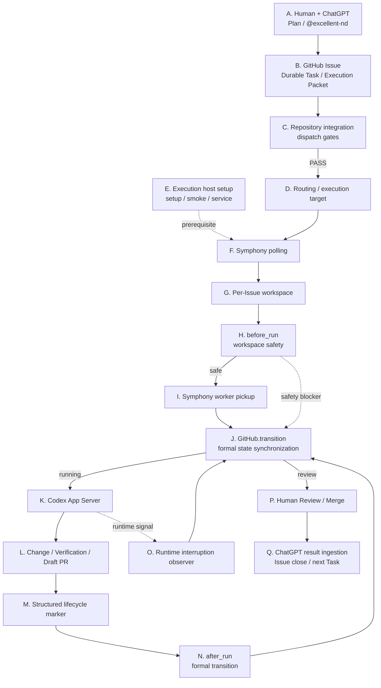
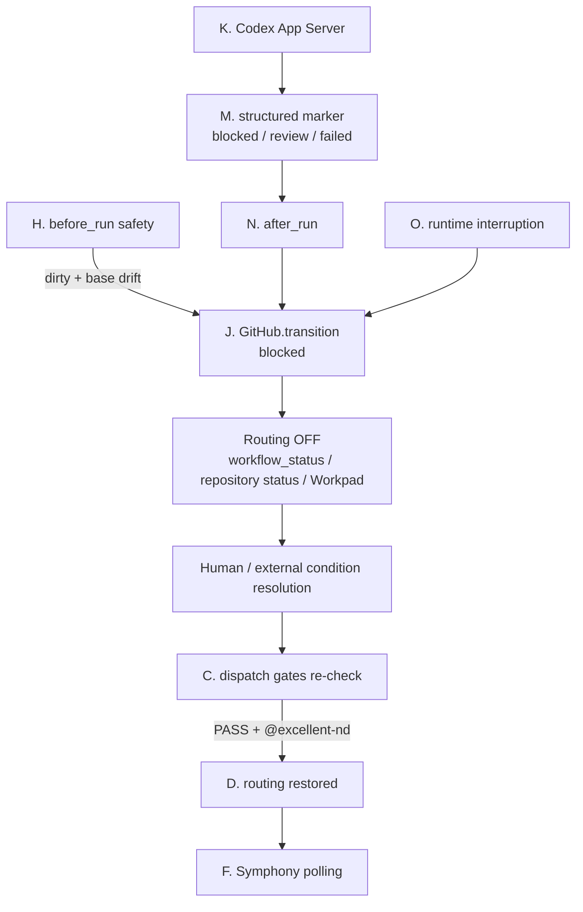
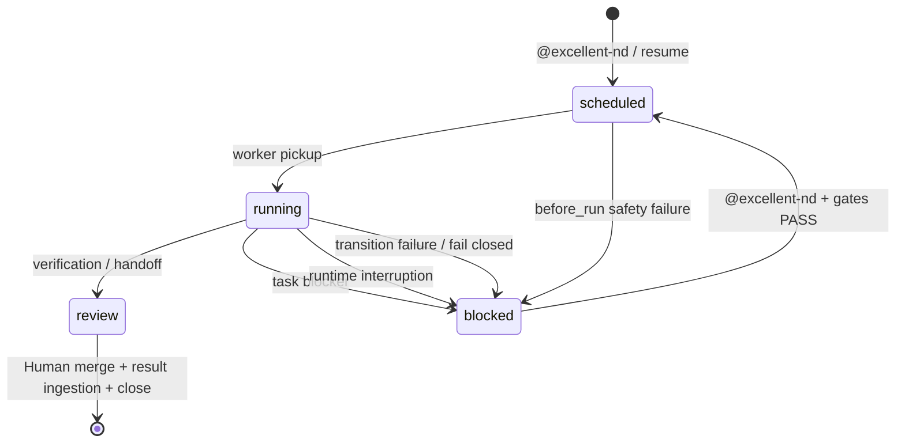

# Excellent-Nd 运行时架构指南

当前user message中的 `@excellent-nd`（不区分大小写）是Execution Mode selector，表示由ChatGPT转为委托Excellent-Nd → Issue → Symphony → Codex执行。它本身就是人工执行指令，无需额外Human GO。无标签的自然语言、Skill自动选择、现有Issue或Plan metadata本身均不授权新的dispatch / resume。

参阅[Flow与continuation边界正本](design.md#execution-modeとflow境界)。

[日本語（规范原文）](runtime-architecture.md) | [English](runtime-architecture.en.md)

本文面向第一次接触 GitHub Issue、OpenAI Symphony 和 Codex App Server 的读者，目标是说明 Excellent-Nd 内部“发生了什么、按什么顺序发生、由哪些源码负责”。

日文版是说明的正式版本。安装和日常运维请参阅[使用指南](operations.zh-CN.md)，整体设计请参阅[设计](design.md)。

> 本文中的“Symphony”指 `config/runtime-lock.json` 固定的 `openai/symphony` runtime。已验证版本以该文件为准。upstream 一般规范请参阅 [OpenAI Symphony SPEC](https://github.com/openai/symphony/blob/main/SPEC.md) 和 [Elixir implementation README](https://github.com/openai/symphony/blob/main/elixir/README.md)。

---

## 1. 基本术语

| 术语 | 初学者理解 | Excellent-Nd中的作用 |
| --- | --- | --- |
| ChatGPT | 人进行计划和判断的主要界面 | Task拆分、明确的 `@excellent-nd` 执行指令、结果回收 |
| GitHub Issue | 一张可长期保存的工作票 | Durable Task、Execution Packet、Workpad |
| Execution Packet | 交给Codex的工作说明 | 整个Issue body |
| routing label | “允许进入执行候选”的开关 | 通常是 `symphony-ready` |
| target label | 指定哪个执行主机可以领取 | `nd-target:<execution_target>` |
| workflow status | Task逻辑状态 | `scheduled / running / blocked / review` |
| repository-native status | 目标仓库自己的进度状态 | label或GitHub Project字段 |
| Symphony | coding-agent编排器 | polling、workspace、hook、retry、Codex启动 |
| workspace | 每个Issue专用工作目录 | 原则上每Issue一个 |
| observer | 包裹Symphony的Excellent-Nd进程 | worker start和状态同步 |
| Codex App Server | 实际执行repository工作的agent | 调查、修改、验证 |
| Workpad | Issue中的执行证据 | start、blocker、verification、handoff |
| transition | 正式状态更新 | body、routing、Project Status、Workpad |
| fail closed | 无法证明安全时停止 | 关闭routing并保存证据 |

Excellent-Nd对人是conversation-first，对内部执行是Issue-first。Issue是可持续追踪的执行记录，不是人的主要操作UI。

---

## 2. 端到端处理流程

### 2.1 与 Node A-Q 对应的正常流程

图中每个块都显示 **A-Q** Node标识。GitHub 的 Mermaid renderer 在不同视图中对图内点击链接支持并不稳定，因此图中只保留 A-Q 标识；图下方的 Node index 作为正式导航方式。



**Node index:** [A](#node-a) → [B](#node-b) → [C](#node-c) → [D](#node-d) → [E](#node-e) → [F](#node-f) → [G](#node-g) → [H](#node-h) → [I](#node-i) → [J](#node-j) → [K](#node-k) → [L](#node-l) → [M](#node-m) → [N](#node-n) → [O](#node-o) → [P](#node-p) → [Q](#node-q)

Node E是execution host前提，不是每个Task的串行步骤。Node J是状态同步中心：worker start、before_run blocker、after_run marker和runtime interruption最终都进入同一个正式transition路径。

### 2.2 Blocked / resume流程



---

---

## 3. Symphony与Excellent-Nd的边界

upstream Symphony负责从Issue tracker读取候选任务、管理每Issue workspace、执行hook、启动coding agent，以及retry / continuation / concurrency。

Excellent-Nd不fork这些职责，而是在Symphony前后增加ChatGPT policy、repository mapping和GitHub lifecycle同步。

| 领域 | 主要负责方 | Excellent-Nd实现 |
| --- | --- | --- |
| Issue polling | Symphony | generated `WORKFLOW.md` |
| required-label过滤 | Symphony | `config/WORKFLOW.md.tpl` |
| workspace lifecycle | Symphony | workspace配置 + hooks |
| retry / continuation | Symphony | upstream runtime |
| Codex启动 | Symphony | `codex.command` |
| `@excellent-nd` / Plan | Excellent-Nd Skill | `skills/excellent-nd/` |
| repository gate | Excellent-Nd | `scripts/repository_adapter.py` |
| target routing | Excellent-Nd | `scripts/execution_target.py` |
| workspace安全检查 | Excellent-Nd | `runtime_observer.py::prepare_workspace` |
| running状态检测 | Excellent-Nd | `runtime_observer.py::run_observer` |
| Project Status mapping | Excellent-Nd | `repository_adapter.py::transition_event` |
| blocked/review/failed handoff | Excellent-Nd | structured marker + observer |
| 常驻service | Excellent-Nd | systemd helpers |
| setup / version pin / smoke | Excellent-Nd | `runtime-lock.json`, `setup.py`, `smoke.py` |

Excellent-Nd主要利用Symphony的 `after_create`、`before_run`、`after_run` hook。尤其 `before_run` 用于Codex启动前安全检查，`after_run` 用于正式lifecycle handoff。

---

## 4. 各节点处理与源码

### Node A

**ChatGPT / 明确执行指令**

源码:

- `skills/excellent-nd/SKILL.md`
- `skills/excellent-nd/references/task-schema.md`
- `skills/excellent-nd/references/workflow.md`

Human与ChatGPT确定目标、约束、验收条件、依赖、owner和execution target。执行时在当前user message中明确指定 `@excellent-nd`；不再要求额外批准语句。

### Node B

**GitHub Issue作为Durable Task**

Issue保存Execution Packet和持续证据。整个Issue body会作为Task上下文交给Codex。Issue native state、`workflow_status`、routing和repository-native status是不同状态面。

### Node C

**Repository integration / dispatch gate**

源码:

- `scripts/repository_config.py`
- `scripts/repository_adapter.py::resolve_context`
- `scripts/repository_adapter.py::evaluate_gates`
- `scripts/repository_adapter.py::preflight`

Excellent-Nd Core不强制所有repository都有Status、Agent、Human Approval等固定字段。consumer repository只在 `.excellent-nd/repository.json` 配置自己真正需要的gate。必要数据无法取得、对象不唯一或configured gate失败时，fail closed。

### Node D

**Routing / execution target**

源码:

- `scripts/execution_target.py`
- `.excellent-nd/targets/*.json`
- `config/WORKFLOW.md.tpl`

routing label控制是否可dispatch，target label指定execution host。target inventory中的 `enabled: true` 不是online heartbeat。

### Node E

**Execution host setup**

源码:

- `scripts/setup.py`
- `scripts/smoke.py`
- `scripts/service_runner.py`
- `scripts/systemd_service.py`
- `config/runtime-lock.json`

setup检查依赖、下载并校验固定Symphony asset、生成WORKFLOW、执行smoke、保存host/target identity，并可安装或restart systemd user service。

### Node F

**Symphony polling**

源码:

- `config/WORKFLOW.md.tpl`
- generated `.excellent-nd/WORKFLOW.md`
- upstream Symphony

Symphony轮询tracker，并按active states和required labels筛选候选Issue。polling实现本身属于upstream Symphony。

### Node G

**Per-Issue workspace**

Symphony管理每Issue workspace生命周期。Excellent-Nd使用与Issue关联的workspace identity进行host-side安全检查。

主要入口:

- `config/WORKFLOW.md.tpl`
- `runtime_observer.py::issue_from_workspace`

### Node H

**before_run workspace safety**

源码:

- `runtime_observer.py::prepare_workspace`
- `runtime_observer.py::workspace_decision`

| workspace | local与remote关系 | 处理 |
| --- | --- | --- |
| clean | drift | refresh到remote default branch |
| dirty | same base | 保留并继续 |
| dirty | drift | **Codex启动前blocked** |

不会自动reset dirty + drift，因为可能删除尚未commit的有效成果。

### Node I

**Symphony worker pickup**

源码:

- `runtime_observer.py::worker_started_issue`
- `runtime_observer.py::run_observer`

只接受经过验证的exact Symphony worker-start event，作为实际开始执行的证据。

### Node J

**正式GitHub lifecycle transition**

源码:

- `runtime_observer.py::GitHub.transition`
- `runtime_observer.py::runtime_event_for`
- `repository_adapter.py::transition_event`

顺序:

1. 先关闭routing
2. 更新Issue body的workflow status
3. 如果配置了repository-native status则更新
4. 写Workpad证据
5. 只有前面全部成功后，才在需要routing的最终状态恢复routing

中间失败时routing保持OFF。worker pickup变为 `running`，并映射到repository event `execution_started`。

### Node K

**Codex App Server执行**

WORKFLOW在 `workspace-write` 下启动 `codex app-server`。Codex执行repository调查、修改和验证，不通过危险权限绕过受保护的Git metadata。

### Node L

**Change / verification / Draft PR**

正常输出应包括changed files、verification、branch/commit、Draft PR、residual risk和Workpad handoff。仅仅“代码写完”不等于最终完成。

### Node M

**Structured lifecycle marker**

marker:

`.excellent-nd/runtime-transition.json`

schema:

`excellent-nd/runtime-transition@v1`

源码:

- `validate_transition_marker`
- `transition_identity`
- `validated_receipt`

允许transition: `blocked / review / failed`。

### Node N

**after_run正式transition**

源码:

- `WORKFLOW.md.tpl` 的 `after_run`
- `runtime_observer.py::apply_transition_marker`

host将structured marker送入同一个正式 `GitHub.transition` 路径。receipt绑定repository、Issue、run、attempt、transition实现幂等。marker缺失、损坏、未知transition或receipt异常时，不猜测，fail closed为blocked。

### Node O

**Runtime interruption观察**

源码:

- `classify_interruption`
- `extract_context`
- `interruption_workpad`
- `run_observer`

例如quota exhaustion、长时间rate limit、turn timeout、App Server启动失败、agent异常退出。

### Node P

**Human review / merge**

进入review后routing关闭。Human review / merge仍然是Gate；runtime不会把“Codex写完代码”解释为最终验收。

### Node Q

**ChatGPT result ingestion**

ChatGPT读取Issue、PR、Workpad和verification，将结果重新合并回原Plan。验收完成后可Close Issue，并进入下一个Task。

---

## 5. 理解状态的5个界面

| 界面 | 示例 | 含义 |
| --- | --- | --- |
| GitHub Issue native state | open / closed | ticket是否active |
| `workflow_status` | scheduled / running / blocked / review | Excellent-Nd逻辑状态 |
| routing label | `symphony-ready` | Symphony能否领取 |
| target label | `nd-target:worker-a` | 哪个host能领取 |
| repository-native Status | Todo / Working / Hold | consumer repository自己的状态正本 |

正常情况下，Excellent-Nd transition保持这些界面一致。status authority由 `.excellent-nd/repository.json` 决定，可以是labels或GitHub Project field。

---

## 6. 状态模型



---

## 7. 已发现的意外缺陷与改进

本节只记录Excellent-Nd Core问题。consumer repository自己的治理或业务Rule冲突属于另一类问题。

| 发现 | 影响 | 修复 / 经验 | 相关 |
| --- | --- | --- | --- |
| routing与可视化status容易混淆 | UI变更可能改变dispatch语义 | 分离routing和status | PR #7 |
| execution_target只写metadata不能保证host routing | 多host不能安全区分 | target-specific label + inventory | PR #11 |
| setup缺少 `write_target_record` import | smoke后仍可能失败 | import + regression test | PR #13 |
| Repository / Issue integration不是独立安装阶段 | 容易与现有label/automation冲突 | 增加integration review和config SSOT | PR #15 |
| Project Field不能在Core中hard-code | Core无法泛化 | generic event mapping / dispatch gates | PR #17 |
| CI可能0 tests也显示成功；非法repository path被接受 | 假green、输入验证不足 | real discovery + fail closed | PR #18 |
| foreground runtime不适合长期host | restart/status/log困难 | systemd user service | PR #21 |
| worker pickup没有连接到 `execution_started` | Codex运行但UI仍像未开始 | exact event -> running | Issue #22 / PR #23 |
| task-level blocker可能只写comment | body/routing/Project status不一致 | structured marker ->正式transition | Issue #22 / PR #23 |
| dirty workspace在旧base上仍能启动Codex | stale-base执行 | dirty + drift在Codex前blocked | Issue #22 / PR #23 |

### Core问题 vs consumer repository问题

Core问题通常不依赖某个repository的业务Rule，例如worker-start状态同步、hook处理、target routing、setup实现缺陷。

consumer repository问题依赖本地policy或mapping，例如错误的 `.excellent-nd/repository.json` gate、互相冲突的治理规则、错误dependency。

不要把consumer特有Rule hard-code到Excellent-Nd Core。

可以问：

> 换一个repository、使用等价配置后是否仍能复现？

如果能，Core问题的可能性高；如果依赖特定policy/mapping，则更可能是consumer侧。

---

## 8. Debug顺序

当界面无法判断是否正在工作时，不要只看一个状态。

1. GitHub Issue native state
2. `workflow_status`
3. routing / target labels
4. repository-native Status
5. latest Workpad
6. branch / PR
7. systemd service
8. observer / Symphony process
9. runtime journal
10. workspace HEAD / dirty state

host检查:

```sh
systemctl --user status 'excellent-nd@<instance>.service' --no-pager
systemctl --user is-active 'excellent-nd@<instance>.service'
journalctl --user -u 'excellent-nd@<instance>.service' -n 100 --no-pager
pgrep -af 'runtime_observer.py|symphony'
```

workspace检查:

```sh
git status --short
git rev-parse HEAD
git diff --check
```

remote default branch必须fresh取得后比较。

---

## 9. Source code map

| 想知道什么 | 首先查看 |
| --- | --- |
| 项目整体 | `README.md`, `docs/design.md` |
| 操作步骤 | `docs/operations.zh-CN.md` |
| 明确的 `@excellent-nd` / Skill | `skills/excellent-nd/SKILL.md` |
| Task metadata | `skills/excellent-nd/references/task-schema.md` |
| Repository config | `scripts/repository_config.py` |
| Dispatch gates | `repository_adapter.py::preflight` |
| Project status update | `repository_adapter.py::transition_event` |
| Runtime version pin | `config/runtime-lock.json` |
| Workflow template | `config/WORKFLOW.md.tpl` |
| Execution targets | `scripts/execution_target.py` |
| Setup | `scripts/setup.py` |
| Smoke | `scripts/smoke.py` |
| Service start | `scripts/service_runner.py` |
| Worker start observer | `runtime_observer.py::run_observer` |
| Formal transition | `runtime_observer.py::GitHub.transition` |
| Workspace preflight | `runtime_observer.py::prepare_workspace` |
| Structured marker | `runtime_observer.py::apply_transition_marker` |
| Runtime interruption | `runtime_observer.py::classify_interruption` |
| Regression tests | `tests/test_runtime_observer.py` |

---

## 10. 推荐阅读顺序

1. 本文
2. `README.md`
3. `docs/operations.zh-CN.md`
4. `config/WORKFLOW.md.tpl`
5. `scripts/runtime_observer.py`
6. `scripts/repository_adapter.py`
7. `tests/test_runtime_observer.py`
8. 需要更深细节时再阅读upstream Symphony SPEC

当lifecycle节点、hook contract、status authority、routing semantics、workspace recovery或固定的Symphony/Codex行为发生变化时，应同步更新本文。
